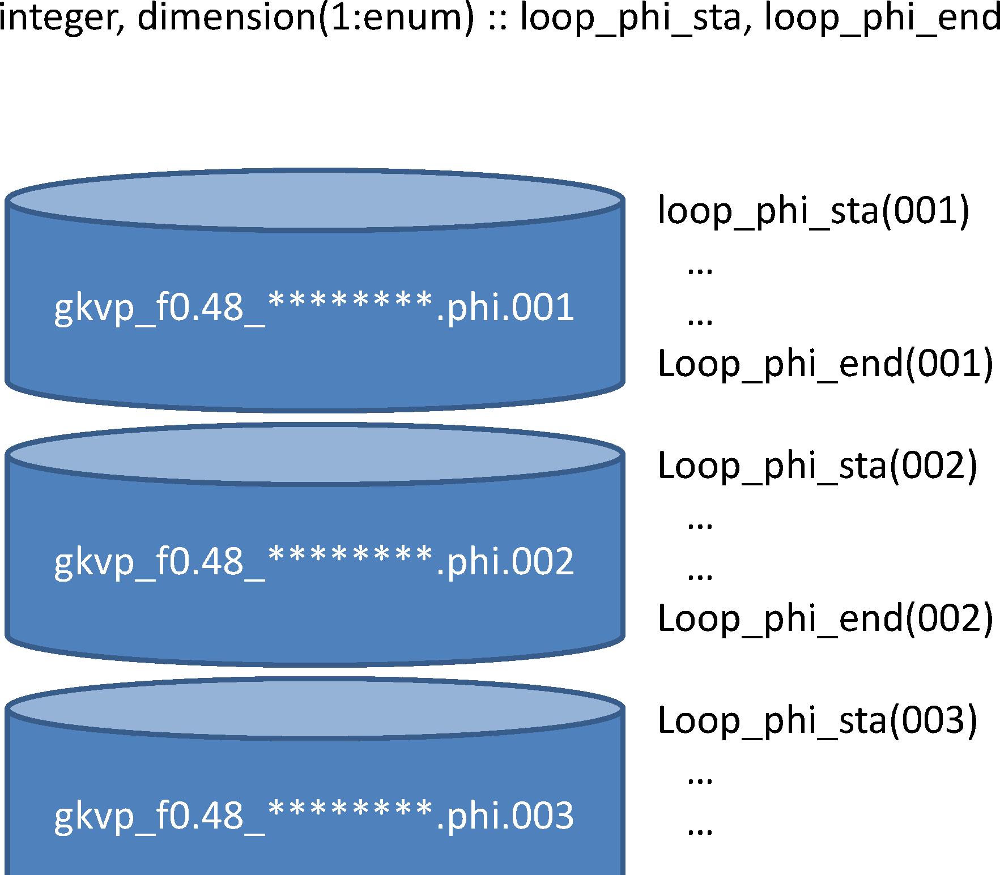

.. _sec_data-reading-module-diag_rb-in-the-post-processing-program-diag:

Data-reading module diag_rb in the post-processing program diag
================================================================================

   Output record number in the post-processing program ``diag``

To read GKV binary output in the post-processing program ``diag``, use the
data-reading module ``diag_rb``.

.. code-block:: fortran
   :caption: An example to use diag_rb
   :name: codeblock:use-diag_rb

   use diag_rb, only : rb_phi_loop
   complex(kind=DP) :: phi(-nx:nx, 0:global_ny, -global_nz:global_nz-1)
   integer :: loop = 100
   call rb_phi_loop(loop, phi) ! Read potential phi at output record loop=100 (time=dtout_ptn*loop)

The output record number ``loop`` is counted up from the first run
(``inum`` =1) by evaluating file size of GKV binary output. As shown in
:numref:`fig:output_record_number`, output record number for the
binary output ``$DIR/phi/*phi*`` is from ``loop_phi_sta`` (001) = 0 to
``loop_phi_end(enum)`` = ``nloop_phi``. Therefore, even if you analyze only
run numbers from ``snum`` :math:`>1` to ``enum``, all GKV binary output data from
``inum`` =1 should be left in the diagnosed directory.

Taking a look at the source code of ``diag_rb``, one finds various types
of subroutines which read electrostatic potential
:math:`\tilde{\phi}_{\bm{k}}` in :math:`(k_x,k_y,z)` or in :math:`(k_x,k_y)` at a given
:math:`z` or in :math:`(z)` for a given mode :math:`k_x, k_y`, etc., and similarly read
magnetic vector potential :math:`\tilde{A}_{\parallel\bm{k}}`, fluid moments,
and so on. Some typical subroutines are listed below.
One may find more efficient subroutine in the source code of ``diag_rb``.

**List of subroutines in the data-reading module** ``diag_rb``

.. list-table:: rb_phi_gettime(loop, time)
   :widths: 6 40
   :header-rows: 1

   * - Field
     - Description
   * - Arguments
     -
       + integer, intent(in) :: loop
       + real(kind=DP), intent(out) :: time
   * - GKV binary output
     - phi/gkvp_f0.48_(rankg in 6 digits).0.phi.(inum in 3 digits)
   * - Description
     - Read simulation time :math:`time` corresponding to the output record :math:`loop`. (:math:`time \simeq dtout\_ptn \times loop`)

.. list-table:: rb_Al_gettime(loop, time)
   :widths: 6 40
   :header-rows: 1

   * - Field
     - Description
   * - Arguments
     -
       + integer, intent(in) :: loop
       + real(kind=DP), intent(out) :: time
   * - GKV binary output
     - phi/gkvp_f0.48_(rankg in 6 digits).0.Al.(inum in 3 digits)
   * - Description
     - Read simulation time :math:`time` corresponding to the output record :math:`loop`. (:math:`time \simeq dtout\_ptn \times loop`)

.. list-table:: rb_mom_gettime(loop, time)
   :widths: 6 40
   :header-rows: 1

   * - Field
     - Description
   * - Arguments
     -
       + integer, intent(in) :: loop
       + real(kind=DP), intent(out) :: time
   * - GKV binary output
     - phi/gkvp_f0.48_(rankg in 6 digits).(ranks in 1 digit).mom.(inum in 3 digits)
   * - Description
     - Read simulation time :math:`time` corresponding to the output record :math:`loop`. (:math:`time \simeq dtout\_ptn \times loop`)

.. list-table:: rb_trn_gettime(loop, time)
   :widths: 6 40
   :header-rows: 1

   * - Field
     - Description
   * - Arguments
     -
       + integer, intent(in) :: loop
       + real(kind=DP), intent(out) :: time
   * - GKV binary output
     - phi/gkvp_f0.48_(rankg in 6 digits).(ranks in 1 digit).trn.(inum in 3 digits)
   * - Description
     - Read simulation time :math:`time` corresponding to the output record :math:`loop`. (:math:`time \simeq dtout\_eng \times loop`)

.. list-table:: rb_phi_loop(loop, phi)
   :widths: 6 40
   :header-rows: 1

   * - Field
     - Description
   * - Arguments
     -
       + integer, intent(in) :: loop
       + complex(kind=DP), intent(out) :: phi(-nx:nx,0:global_ny,-global_nz:global_nz-1)
   * - GKV binary output
     - phi/gkvp_f0.48_(rankg in 6 digits).0.phi.(inum in 3 digits)
   * - Description
     - Read electrostatic potential :math:`phi` corresponding to the output record :math:`loop`. (:math:`time \simeq dtout\_ptn \times loop`)

.. list-table:: rb_Al_loop(loop, Al)
   :widths: 6 40
   :header-rows: 1

   * - Field
     - Description
   * - Arguments
     -
       + integer, intent(in) :: loop
       + complex(kind=DP), intent(out) :: Al(-nx:nx,0:global_ny,-global_nz:global_nz-1)
   * - GKV binary output
     - phi/gkvp_f0.48_(rankg in 6 digits).0.Al.(inum in 3 digits)
   * - Description
     - Read vector potential :math:`Al` corresponding to the output record :math:`loop`. (:math:`time \simeq dtout_ptn \times loop`)

.. list-table:: rb_mom_imomisloop(imom, is, loop, mom)
   :widths: 6 40
   :header-rows: 1

   * - Field
     - Description
   * - Arguments
     -
       + integer, intent(in) :: imom, is, loop
       + complex(kind=DP), intent(out) :: mom(-nx:nx,0:global_ny,-global_nz:global_nz-1)
   * - GKV binary output
     - phi/gkvp_f0.48_(rankg in 6 digits).(ranks in 1 digit).mom.(inum in 3 digits)
   * - Description
     - Read a fluid moment :math:`mom` corresponding to the output record :math:`loop` (:math:`time \simeq dtout\_ptn * loop`), where :math:`is` specifies the plasma species, and :math:`imom=0-5` correspond to :math:`\tilde{n}_{\mathrm{s}\bm{k}}`, :math:`\tilde{u}_{\parallel\mathrm{s}\bm{k}}`, :math:`\tilde{p}_{\parallel\mathrm{s}\bm{k}}`, :math:`\tilde{p}_{\perp\mathrm{s}\bm{k}}`, :math:`\tilde{q}_{\parallel\parallel\mathrm{s}\bm{k}}`, :math:`\tilde{q}_{\parallel\perp\mathrm{s}\bm{k}}`.

.. list-table:: rb_trn_itrnisloop(itrn, is, loop, trn)
   :widths: 6 40
   :header-rows: 1

   * - Field
     - Description
   * - Arguments
     -
       + integer, intent(in) :: itrn, is, loop
       + real(kind=DP), intent(out) :: trn(-nx:nx,0:global_ny)
   * - GKV binary output
     - phi/gkvp_f0.48_(rankg in 6 digits).(ranks in 1 digit).trn.(inum in 3 digits)
   * - Description
     - Read a variable corresponding to the entropy balance :math:`trn` at the output record :math:`loop` (:math:`time \simeq dtout\_eng * loop`), where :math:`is` specifies the plasma species, and :math:`itrn=0-11` correspond to perturbed gyrocenter entropy, electrostatic field energy including polarization, magnetic field energy, wave-particle interaction via electrostatic fluctuations, wave-particle interaction via magnetic fluctuations, nonlinear entropy transfer via :math:`\bm{E}\times\bm{B}` flows, nonlinear entropy transfer via magnetic flutters, collisional dissipation, particle flux by :math:`\bm{E}\times\bm{B}` flows, particle flux by magnetic flutters, energy flux by :math:`\bm{E}\times\bm{B}` flows, energy flux by magnetic flutters.
