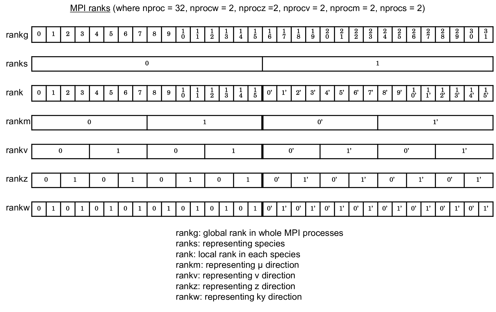
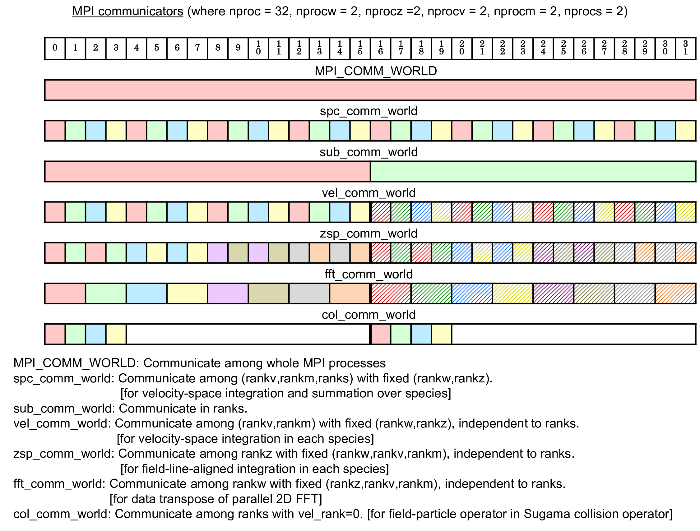
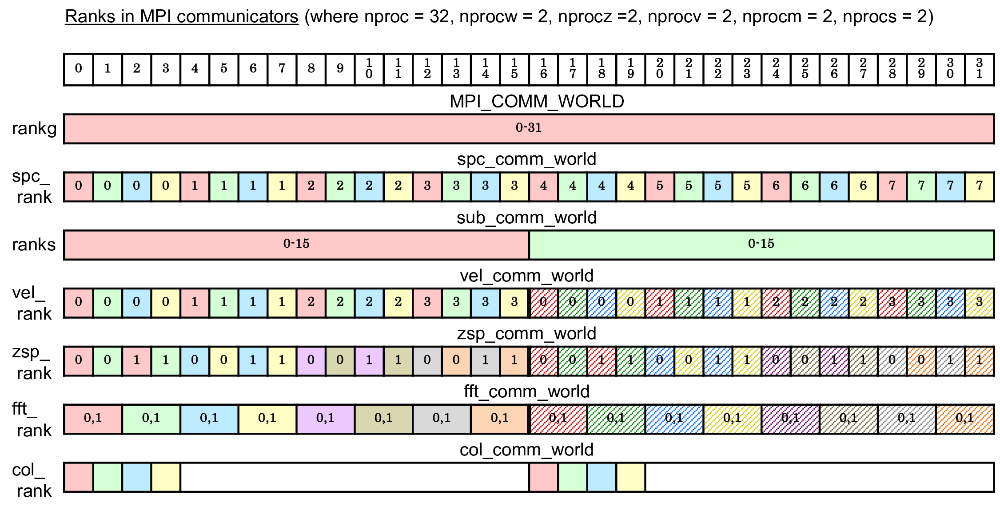

.. _chap_discretization:

Discretization
====================

.. _sec_spatial-discretization:

Spatial discretization
------------------------------

GKV is a Vlasov (continuum) simulation code. The perpendicular
directions are already given by a discrete representation in Fourier
space :math:`(k_x, k_y)`. The other three directions :math:`(z,v_\parallel,\mu)` are
discretized by an equidistant grid. Defining box sizes
:math:`-L_x \leq \bar{x} < L_x, -L_y \leq \bar{y} < L_y, -L_z \leq \bar{z} < L_z, -L_v \leq \bar{v}_\parallel \leq L_v, 0 \leq \bar{\mu} \leq \frac{L_v^2}{2}`
and grid numbers
:math:`(2\mathtt{nx}+1,\mathtt{global\_ny}+1,2\mathtt{global\_nz},2\mathtt{global\_nv},\mathtt{global\_nm}+1)`
in :math:`(k_x,k_y,z,v_\parallel,\mu)`, the grid of GKV is given by

.. math::

   k_x &= \mathtt{mx} \Delta k_x ~~(-\mathtt{nx} \leq \mathtt{mx} \leq \mathtt{nx}), \nonumber \\
   k_y &= \mathtt{my} \Delta k_y ~~(0 \leq \mathtt{my} \leq \mathtt{global\_ny}) \nonumber \\
   z &= \mathtt{iz} \Delta z ~~(-\mathtt{global\_nz} \leq \mathtt{iz} \leq \mathtt{global\_nz-1}), \nonumber \\
   v_\parallel &= -L_v + (\mathtt{iv}-1) \Delta v_\parallel ~~(1 \leq \mathtt{iv} \leq 2\mathtt{global\_nv}), \nonumber \\
   \mu &= \frac{(\mathtt{im} \Delta w)^2}{2} ~~(0 \leq \mathtt{im} \leq \mathtt{global\_nm}), \nonumber

where
:math:`\Delta k_x = \frac{\pi}{L_x}, \Delta k_y = \frac{\pi}{L_y}, \Delta z = \frac{L_z}{\mathtt{global\_nz}}, \Delta v_\parallel = \frac{2L_v}{2\mathtt{global\_nv}-1}, \Delta w = \frac{L_v}{\mathtt{global\_nm}}`.

Derivatives in :math:`(z,v_\parallel,\mu)` are discretized by finite
difference method, and then, GKV solves the :math:`\delta f` gyrokinetic
equations, Eqs. :eq:`eq:vlasoveq_normalized` -- :eq:`eq:ampereeq_normalized`, in :math:`(k_x,k_y,z,v_\parallel,\mu)`
space, except for the nonlinear term. Since direct calculation of
nonlinear convolution in wavenumber space is computationally expensive,
the nonlinear term is evaluated in the real space, employing
:math:`(2\mathtt{nxw},2\mathtt{nyw},2\mathtt{global\_nz},2\mathtt{global\_nv},\mathtt{global\_nm}+1)`
grid points in :math:`(x,y,z,v_\parallel,\mu)`, and is transformed back to the
wavenumber space by means of 2D Fast Fourier Transform (FFT) algorithm
and the 3/2 de-aliasing rule in :math:`(k_x, k_y)`.

To implement the pseudo-periodic boundary condition along a field line,
Eq. :eq:`eq:boundarycondition`, the shift of the radial wave number
:math:`\delta k_x (k_y) = - 2N_\theta \pi \hat{s} k_y` as a function of :math:`k_y`
should be equal to the integral multiple of the minimum radial wave
number :math:`\Delta k_x`. This gives a constraint between radial and
field-line-label box sizes. In GKV, the minimum field-line-label wave
number :math:`\Delta k_y` and the ratio
:math:`m = \left| \frac{\delta k_x (\Delta k_y)}{N_\theta \Delta k_x} \right|`
are given in the namelist (``kymin`` and ``m_j``, respectively), and then,
:math:`\Delta k_x = |2\pi \hat{s} \Delta k_y / m|`, :math:`L_x = \pi /\Delta k_x`,
:math:`L_y = \pi / \Delta k_y`.

Choice of velocity-space coordinate
^^^^^^^^^^^^^^^^^^^^^^^^^^^^^^^^^^^^^^^^

After gkvp_f0.63, altanate velocity space coordinate, the parallel and perpendicular velocities :math:`(v_\parallel, v_\perp)` rather than the magnetic coordinate :math:`(v_\parallel, \mu)`. This choice is beneficial when the magnetic field strength significantly varies, like the dipole geometry. Switching the velocity-space coordinates is done in run/gkvp_namelist:

.. code-block::

    vp_coord = 0, # For (vl,mu) coordinates

or

.. code-block::

    vp_coord = 1, # For (vl,vp) coordinates

In the equation, the parallel advection term is modified:

.. math::

   \frac{\partial}{\partial z}_{(z,v_\parallel,\mu)} \rightarrow \frac{\partial}{\partial z}_{(z,v_\parallel,v_\perp)} + \frac{v_\perp}{2B}\frac{\partial B}{\partial z}\frac{\partial}{\partial v_\perp}_{(z,v_\parallel,v_\perp)}

.. _sec_temporal-discretization:

Temporal discretization
------------------------------

Explicit implementation
^^^^^^^^^^^^^^^^^^^^^^^^^^^^^^

GKV usually uses 4th-order explicit Runge-Kutta-Gill method. :cite:p:`discretization-Gill1951PCPS`

Explicit collisionless physics and implicit collision implementation
^^^^^^^^^^^^^^^^^^^^^^^^^^^^^^^^^^^^^^^^^^^^^^^^^^^^^^^^^^^^^^^^^^^^^^

An alternative option is implicit collision solver which is useful for
Lorentz or Sugama collision operators having velocity-dependent
collision frequencies :cite:p:`discretization-Maeyama2019CPC`. Splitting collisionless physics
and collision operator by means of 2nd-order (Strang) operator split,
the collisionless physics is solved by using 4th-order explicit
Runge-Kutta-Gill method, while the collision operator is solved by using
2nd-order semi-implicit Crank-Nicolson method. Bi-CGSTAB method is used
as an iterative matrix solver for implicit collision.

.. _sec_inter-node-decomposition-by-using-mpi:

Inter-node decomposition by using MPI
----------------------------------------

The computations are parallelized by using the OpenMP/MPI hybrid
parallelization which suites for hierarchical hardware of the nodes
having a number of cores with a shared memory and connected by an
interconnect network.

   An example of MPI ranks in GKV.

   An example of MPI communicators in GKV.

   An example of MPI ranks in communicators in GKV.

Taking advantage of the multi-dimensional problem, multi-dimensional
domain decomposition is applied for :math:`y`, :math:`z`, :math:`v_\parallel`, :math:`\mu` and
:math:`s`, where 2D FFTs in :math:`x` and :math:`y` are parallelized by means of the
transpose split method. Then, the required MPI communications are data
transpose for the parallel 2D FFTs in :math:`x` and :math:`y`, point-to-point
communications in :math:`z`, :math:`v_\parallel` and :math:`\mu` for finite difference
methods, and reduction communications over :math:`v_\parallel`, :math:`\mu` and :math:`s`
for velocity-space and species integration.
Figures :numref:`%s <fig:MPI_ranks_communicators_1>` -- :numref:`%s <fig:MPI_ranks_communicators_3>`
show schematic pictures of
the multi-layer structure of the multi-dimensional domain decomposition,
illustrating the case that :math:`y`, :math:`z`, :math:`v_\parallel`, :math:`\mu` and :math:`s` are
respectively split by two MPI processes (and thus :math:`2^5=32` processes in
total). Plasma species :math:`s` are decomposed as :math:`\texttt{ranks} = 0, 1`,
and each species are hierarchically decomposed by the magnetic moment
:math:`\mu` (``rankm``), the parallel velocity :math:`v_\parallel` (``rankv``), the
parallel direction :math:`z` (``rankz``), and the perpendicular direction :math:`x,y`
(``rankw``). Thus, data transpose in :math:`x` and :math:`y` is performed for
different subranks of ``rankw`` by using ``fft_comm_world`` communicator,
point-to-point communications in :math:`z` (:math:`v` or :math:`m`) are performed between
``rankz`` (``rankv`` or ``rankm``), while reduction communications over :math:`v`,
:math:`\mu` and :math:`s` are performed for fixed ``rankz`` and ``rankw`` by using
``spc_comm_world`` communicator.

.. _sec_intra-node-decomposition-by-using-openmp:

Intra-node decomposition by using OpenMP
----------------------------------------

Intra-node decomposition is basically implemented by loop-level
parallelization with OpenMP. Time-consuming MPI communications are
masked by computation-communication overlap technique using MASTER
thread. For more details, see Ref. :cite:p:`discretization-Maeyama2015PC`.

.. _sec_discretization_references:

.. bibliography::
   :style: unsrt
   :filter: docname in docnames
   :keyprefix: discretization-
   :labelprefix: 3-
