Tutorial
==========

.. contents:: Table of Contents
   :depth: 2

.. _sec_python-venv:

Setting up a Python virtual environment
----------------------------------------

A Python virtual environment is set up by following the steps below.

Initial setup 1. Construction of a Python virtual environment

.. code-block:: console

   $ mkdir ~/myvenv/                    # All venv virtual environments are stored under ~/myvenv/.
   $ python3.12 -m venv ~/myvenv/env01  # A virtual environment named env01 is created based on the preinstalled Python 3.12.
   $ source ~/myvenv/env01/bin/activate # The env01 environment is activated.

.. _initial-setup-2:

Initial setup 2. Installation of required Python packages

.. code-block:: console

   $ python -m pip install --upgrade pip        # First, upgrade the package manager pip itself
   $ pip install jupyterlab xarray dask zarr f90nml numba pyevtk pyvista pydmd # for diag_python
   $ pip install bzx                            # for BZX
   $ pip install gkvfig                         # for gkvfig

.. _sec_gkv-download:

Downloading the GKV code
------------------------------

The GKV code can be downloaded with the following command:

.. code-block:: console

   $ wget https://github.com/GKV-developers/gkvp/archive/refs/tags/f0.65.tar.gz -O gkvp-f0.65.tar.gz

The code can also be obtained in other ways.

Alternative method 1.
The file gkvp-f0.65.tar.gz is obtained by accessing https://github.com/GKV-developers/gkvp/, selecting gkvp_f0.65 from the Releases button, downloading the archive, and then transferring it via SSH or a similar method.

Alternative method 2.
For users familiar with Git, the repository may be obtained by running git clone after appropriate configuration.

After downloading, the source code is unpacked as follows:

.. code-block:: console

   $ tar xzvf gkvp-f0.65.tar.gz

If the archive is unpacked correctly, a directory ``gkvp-f0.65/`` is created.

When working on Plasma Simulator subsystem A, the Intel module must be loaded in order to compile the program:

.. code-block:: console

   $ module load intel/2025.1

.. _sec_code-structure-overview:

Code structure and overview of GKV
----------------------------------------

The code structure of GKV (version gkvp_f0.65) is as follows:

.. code-block:: text

   gkvp-f0.65/
     ├── README_for_namelist.txt  Brief notes on the namelist
     ├── Version_memo.txt         Recent update history
     ├── src/                     Source files
     │   ├── gkvp_header.f90      Module for resolution and MPI settings
     │   └── gkvp_out.f90         Module for standard data output
     ├── lib/                     Modules for random number and Bessel-function libraries
     ├── run/                     Compilation and execution of simulations
     │   ├── gkvp_namelist        Physical parameter settings
     │   ├── sub.q                Batch job script (machine dependent)
     │   ├── shoot                Job submission script (machine dependent)
     │   ├── Makefile             Compilation settings (machine dependent)
     │   └── backup/              Backup of sub.q, shoot, and Makefile for other machines
     ├── extra_tools/             Legacy post-processing tools and others
     └── benchmarks/              Benchmark datasets

With GKV, local analysis of microinstabilities, turbulent fluctuations, and particle and heat transport can be carried out under a given equilibrium.

1. Linear analysis

   - Growth rates, real frequencies, and cross-phases among fluctuating quantities are examined.
   - Owing to the independence of linear modes, only specific wavenumbers are analyzed, so the computation is relatively fast.
   - Because nonlinear saturation mechanisms are not included, absolute fluctuation amplitudes are not obtained.

2. Nonlinear analysis

   - Turbulent fluctuation analysis is performed, including fluctuation spectra, particle and heat transport, and various related quantities.
   - Since turbulent mixing involves nonlinear coupling among many modes, the computation is time-consuming. The required resolution depends on the problem, so checks such as entropy balance and convergence of spectra are needed to ensure numerical soundness.

In this tutorial, linear analysis of microinstabilities is carried out under a circular tokamak model magnetic configuration, following the steps below.

1. Physical parameters are specified in ``run/gkvp_namelist``.
2. The numbers of grid points and MPI processes are set in ``src/gkvp_header.f90``.
3. The batch job script ``sub.q`` is configured.
4. The directory settings are adjusted in the job submission script ``shoot``.
5. The program is compiled and the simulation is executed.
6. The output data are analyzed (using post-processing tools).

Nonlinear analysis follows essentially the same procedure, with the calculation type set to ``"nonlinear"`` and with higher resolution adopted as needed.

.. _sec_edit-files:

Editing various files
------------------------------

The procedure for converting experimental measurements into GKV parameters and entering them into the namelist is outlined below.

From experimental measurements, the following steps are taken:

- Choice of radial position for analysis and evaluation of local plasma parameters
- Construction of MHD equilibrium

Next, in order to carry out analysis with GKV, the following steps are performed:

- Conversion (normalization) from experimental values to GKV parameters
- Input of corresponding physical parameters into ``run/gkvp_namelist``
- Processing of MHD equilibrium into metric data required by GKV

In the present tutorial, MHD equilibrium magnetic configuration data are not used. Instead, a circular tokamak magnetic field model, known as the s–alpha model, is adopted. The required parameters are therefore limited to quantities such as inverse aspect ratio, safety factor, magnetic shear, density gradient, and temperature gradient.
(The conversion from experimental data and the reading of MHD equilibrium magnetic configuration data are not treated here.)

The input to the namelist is then adjusted. Entries in ``run/gkvp_namelist`` related to the execution of the simulation are edited as appropriate (for example, setting ``calc_type = "nonlinear"`` for nonlinear simulations, or extending the runtime by specifying ``e_limit = 3600.d0``).

.. code-block:: text
   :caption: run/gkvp_namelist

   &cmemo memo="GKV-plus f0.65 developed for pre-exa-scale computing", &end
   &calct calc_type="lin_freq", # Calculation type: lin_freq / nonlinear
   z_bound="outflow",
   z_filt="off",
   z_calc="cf4",
   art_diff=0.1d0,
   init_random=.true.,
   num_triad_diag=0,
   vp_coord=0, &end # Velocity-space coordinate system: 0 = vl-mu, 1 = vl-vp
   &triad mxt = 0, myt = 0/
   &equib equib_type = "analytic", &end # Equilibrium magnetic field model:
   …                                    #     analytic / s-alpha / s-alpha-shift / circ-MHD /
   …                                    #     vmec / eqdsk / slab / ring
   &runlm e_limit = 60.d0, &end # Wall-clock time limit for the simulation [s]
   &times tend = 200.d0, # Upper limit of simulation time [R_{ref}/v_{ref} ]
   dtout_fxv = 10.d0, # Time interval for data output 1
   dtout_ptn = 0.1d0, # Time interval for data output 2
   dtout_eng = 0.1d0, # Time interval for data output 3
   dtout_dtc = 0.1d0, &end # Interval for adjusting the adaptive time step
   …
   &physp R0_Ln = 2.22d0, # Normalized density gradient R_0/L_{n_s}
   R0_Lt = 6.92d0, # Normalized temperature gradient R_0/L_{T_s}
   nu = 1.d0,
   Anum = 1.d0, # Mass number m_s/m_{ref}
   Znum = 1.d0, # Absolute charge number |e_s|/e
   fcs = 1.d0, # Charge density s_s n_s/(e n_{ref})
   sgn = 1.d0, # Sign of charge e_s/|e_s|
   tau = 1.d0, # Temperature T_s/T_{ref}
   dns1 = 1.d-2,
   tau_ad = 1.d0,
   lambda_i = 0.d0,
   beta = 0.d0, # Plasma beta mu_0 n_{ref} T_{ref}/B_{ref}^2
   2
   …
   &nperi n_tht = 3, # Box size along the field line (poloidal angle ±n_tht*pi)
   kymin = 0.05d0, # Box size in field-line label direction ly = pi/kymin
   m_j = 1, # Radial box size lx = pi/kxmin
   del_c = 0.d0, &end kxmin = |2*pi*s_hat*kymin/m_j|
   &confp eps_r = 0.18d0, # Inverse aspect ratio r_{at-fluxtube-center}/L_{ref}
   eps_rnew = 1.d0,
   q_0 = 1.4d0, # Safety factor q
   s_hat = 0.8d0, # Magnetic shear s

The numbers of grid points and MPI processes are specified in ``src/gkvp_header.f90``.
The total number of grid points (``global_ny``) and the numbers of MPI processes (``nprocw``, ``nprocz``, ``nprocv``, ``nprocm``, ``nporcs``) are adjusted as appropriate.

.. code-block:: fortran
   :caption: src/gkvp_header.f90

   !--------------------------------------
   ! Dimension size (grid numbers)
   !--------------------------------------
   ! Global simulation domain
   ! in x, y,z,v,m (0:2*nxw-1, 0:2*nyw-1,-global_nz:global_nz-1,1:2*global_nv,0:global_nm)
   ! in kx,ky,z,v,m ( -nx:nx,0:global_ny,-global_nz:global_nz-1,1:2*global_nv,0:global_nm)
   integer, parameter :: nxw = 2, nyw = 20
   integer, parameter :: nx = 0, global_ny = 12 ! 2/3 de-aliasing rule
   integer, parameter :: global_nz = 48, global_nv = 24, global_nm = 15
   integer, parameter :: nzb = 2, & ! the number of ghost grids in z
   nvb = 2 ! the number of ghost grids in v and m
   !--------------------------------------
   ! Data distribution for MPI
   !--------------------------------------
   integer, parameter :: nprocw = 1, nprocz = 4, nprocv = 2, nprocm = 2, nprocs = 1

Here,

- ``nx``

  Number of :math:`k_x` modes (index range ``-nx:nx``)

- ``global_ny``

  Number of :math:`k_y` modes (index range ``0:global_ny``).

  The parameters ``nxw`` and ``nyw`` are chosen so that

  ``nxw`` > ``nx`` \* :math:`\frac{3}{2}` and ``nyw`` > ``global_ny`` \* :math:`\frac{3}{2}`.

- ``global_nz``

  Coordinate along the magnetic field line, where :math:`-n_{\text{tht}}\pi < zz < n_{\text{tht}}\pi`

  is discretized with index range ``-global_nz:global_nz-1``.

- ``global_nv``

  Parallel velocity along the field line, where :math:`-v_{\max} < vl < v_{\max}`

  is discretized with index range ``1:2*global_nv``.

- ``global_nm``

  Magnetic moment, where :math:`0 < \mu < v_{\max}^2 / 2`

  is discretized with index range ``0:global_nm`` (for ``vp_coord = 0``),

  or perpendicular velocity, where :math:`0 < vp < v_{\max}`

  is discretized with index range ``0:global_nm`` (for ``vp_coord = 1``).

The parameters ``nprocw``, ``nprocz``, ``nprocv``, ``nprocm``, and ``nprocs`` represent the numbers of MPI domain decompositions in the :math:`k_y`, :math:`zz`, :math:`vl`, :math:`\mu` directions and in the particle-species direction :math:`s`, respectively.

The following conditions are imposed:

- ``(global_ny + 1) / nprocw`` is preferably an integer.
- ``global_nz / nprocz``, ``global_nv / nprocv``, ``global_nm + 1 / nprocm`` must be integers.
- ``nprocs`` matches the number of particle species treated.

When working on Plasma Simulator subsystem A, the batch job script ``sub.q`` and the job submission script ``shoot`` are configured.

In ``run/sub.q``, the MPI/OpenMP parallel configuration is specified.

- The number of MPI processes is set so that it is consistent with ``src/gkvp_header.f90``, e.g.
  ``select*mpiprocs = nprocw * nprocz * nprocv * nprocm * nprocs``.

If the name of the project to which the user belongs is not known, the group directory name corresponding to the project can be checked with the ``check_quota`` command.

.. code-block:: csh
   :caption: run/sub.q

   …
   #PBS -P NIFS23KIST041            # Project name
   #PBS -q A_S                      # Queue class A_dev / A_S / A_M / A_L
   #PBS -l walltime=00:15:00        # Wall-clock time limit (hh:mm:ss)
   #PBS -l select=1:ncpus=128:mem=384gb:mpiprocs=16
                   # Resource request. See Section 8.1.2 of the Plasma Simulator User Guide.
   export OMP_NUM_THREADS=8         # Number of OpenMP threads per MPI process
   …

Then, the directory settings are configured in the job submission script ``shoot``.
``DIR`` may be replaced with any desired path under each user's directory.
Example: ``DIR=/data/(user ID)/gkv_training/linear_test/``

.. code-block:: csh
   :caption: run/shoot

   …
   if [ $# -lt 2 ]; then
     echo "HOW TO USE: ./shoot [START_NUMBER] [END_NUMBER] ([JOB-ID])"
     exit
   fi

   #### Environment setting
   DIR=/data/(User ID)/gkvp/f0.65/ITGae-lin    # Data output directory after execution
   LDM=gkvp.exe
   NL=gkvp_namelist
   SC=qsub
   JS=sub.q
   ### For VMEC, set VMCDIR including metric_boozer.bin.dat
   #VMCDIR=./input_vmec/vmec_sample_nss501ntheta1024nzeta0
   ### For IGS, set IGSDIR including METRIC_{axi,boz,ham}.OUT
   #IGSDIR=../../input_eqdsk_for_eqdskbench/
   …

.. _sec_compile-run:

Compilation and execution
------------------------------

After editing the various files, the code is compiled.

.. code-block:: console

   $ cd gkvp-f0.65/run/
   $ make clean          # Optional
   $ make                # Ensure that 'module load intel' has been executed

The simulation is executed using the ``shoot`` script in the following format, which submits step jobs.

.. code-block:: console

   $ ./shoot START_NUM END_NUM (JOB_ID)

Example usage:

- Single job submission (``*.001``): ``./shoot 1 1``
- Single job submission (``*.002``): ``./shoot 2 2``
- Step job submission (``*.003`` - ``*.005``): ``./shoot 3 5``
- Submission of continuation step jobs: ``./shoot 6 7 11223``
  (In this example, a job with ``JOB_ID = 11223`` that runs up to ``*.005`` is already in the queue, and jobs for ``*.006`` - ``*.007`` are arranged to follow it.)

In this tutorial, a single job is submitted once.

.. code-block:: console

   $ ./shoot 1 1

When using the Plasma Simulator, the status of submitted jobs can be checked with the ``qstat`` command.

.. code-block:: console

   $ qstat

If the simulation finishes normally, the following data are written to the output directory specified in ``run/shoot``
(for example: ``DIR=/data/(user ID)/gkv_training/linear_test/``):

- ``log/`` – Calculation logs
- ``cnt/`` – Binary data for restart (continuation runs)
- ``fxv/`` – Binary data of distribution functions (at several positions along the field line)
- ``phi/`` – Binary data of potential, fluid moments, and entropy balance
- ``hst/`` – Standard output in ASCII format
- Others – Copies for backing up the execution environment

The output files are summarized in Appendix :ref:`sec_list-of-gkv-output`. For further details, see the source file ``src/gkvp_out.f90``. By moving to the output directory, the generated data can be inspected.

.. code-block:: console

   $ cd /data/(User ID)/gkv_training/linear_test/

.. _sec_output-analysis:

Analysis of output data
------------------------------

To analyze the output data, either manual processing is carried out or post-processing tools are used.

a. Manual processing

   - GKV output data are summarized in a list, so subsequent post-processing can be arranged as needed.
   - Standard output in ASCII format is relatively easy to handle.
   - Reading binary data with MPI domain decomposition is rather laborious; however, from ``gkvp_f0.64`` onward, the binary data have also been organized in Zarr format, which allows easy reading in Python.

In the GKV GitHub repository, the following two post-processing tools are provided and may be used:

b. ``gkvfig``, a Python package for batch conversion of ASCII standard output in ``hst/`` into PDF

c. ``diag_python``, a collection of post-processing Python scripts for analyzing binary data such as those in ``phi/``

The items a–c are explained in order below.

a. Manual loading and plotting of GKV output data

Example 1: Time evolution of the squared amplitude of electrostatic potential fluctuations
(from the ASCII output files ``./hst/gkvp.eng.***``)

.. code-block:: python

   #!/usr/bin/env python3
   import numpy as np
   import matplotlib.pyplot as plt
   data = np.loadtxt("./hst/gkvp.eng.001")
   t = data[:,0]
   eng_total = data[:,1]
   plt.plot(t,eng_total,"+-")
   plt.show()

Exponential growth of the fluctuations can be observed.

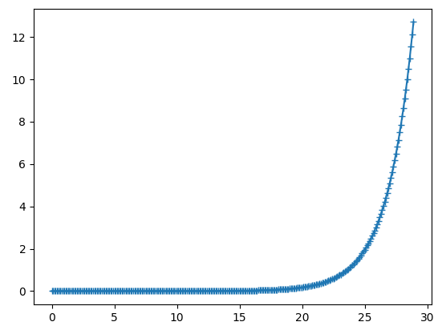

   Time evolution of the squared amplitude of electrostatic potential fluctuations

Example 2: Linear dispersion relation (``./hst/gkvp.dsp.***`` ASCII output files; only for ``calc_type = "lin_freq"``)

.. code-block:: python

   #!/usr/bin/env python3
   import numpy as np
   import matplotlib.pyplot as plt
   data = np.loadtxt("./hst/gkvp.dsp.001")
   ky = data[:,1]
   gamma = data[:,3]
   plt.plot(ky,gamma,"+-")
   plt.show()

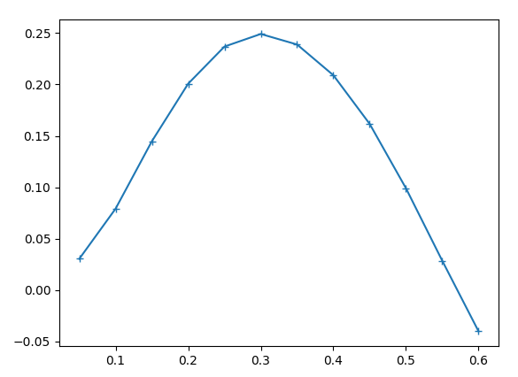

   Linear dispersion relation

Example 3: Dependence of electrostatic potential fluctuations on the coordinate along the magnetic field line (``./phi/gkvp.phi.***.zarr/`` Zarr-format binary output files)

.. code-block:: python

   #!/usr/bin/env python3
   import xarray as xr
   import matplotlib.pyplot as plt
   ds = xr.open_mfdataset("./phi/gkvp.phi.*.zarr", consolidated=False)
   zz = ds.zz[:]
   phi = ds.sel(ky=0.25, method="nearest").phi[-1,:,0]
   plt.plot(zz,phi.real,"+-")
   plt.plot(zz,phi.imag,".-")
   plt.show()

A ballooning structure localized around the bad-curvature region at :math:`z = 0` can be seen.

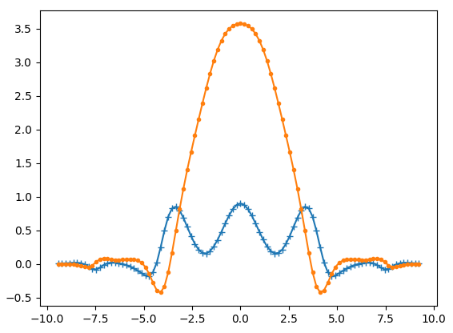

   Dependence of electrostatic potential fluctuations on the coordinate along the magnetic field line

b) ``gkvfig``: a Python package for batch conversion of ASCII standard output in ``hst/`` into PDF

Since ``gkvfig`` has already been installed (see [:ref:`Setting up a Python virtual environment, Initial setup 2 <initial-setup-2>`]), it can be used as a command-line tool as follows.

(i) When the GKV output directory is specified by an absolute path

.. code-block:: console

   $ python -m gkvfig -d /data/(User ID)/gkv_training/linear_test/

(ii) When the GKV output directory is specified by a relative path

.. code-block:: console

   $ cd /data/(User ID)/gkv_training/linear_test/ # Move to the output directory
   $ python -m gkvfig -d ./

The file ``figpdf_YYYYMMDD_HHMMSS/fig_sdtout.pdf`` is obtained, in which the ASCII standard output in ``hst/`` has been batch-converted into PDF.

.. code-block:: console

   (env01) [(User ID)@fes3 ~]$ cd /data/(User ID)/dkv_training/linear_test/
   (env01) [(User ID)@fes3 linear_test]$ python -m gkvfig -d ./
   /data/(User ID)/gkv_training/linaer_test/figpdf_20250723_163935/fig_stdout.pdf generated.
   (env01) [(User ID)@fes3 linear_test]$ ls
   cnt/                     gkvp.exe*          lib/      phi/
   figpdf_20250723_163935/  gkvp_namelist.001  log/      src/
   fxv/                     hst/               Makefile  sub.q.001*
   (env01) [(User ID)@fes3 linear_test]$ ls figpdf_20250723_163935/
   data/  fig/  fig_stdout.pdf
   (env01) [(User ID)@fes3 linear_test]$

As an example of linear simulation output, excerpts from ``fig_stdout.pdf`` are shown. The PDF can be viewed with **evince**.

.. code-block:: console

   $ cd figpdf_YYYYMMDD_HHMMSS/
   $ evince fig_stdout.pdf

Distribution of magnetic field strength, dependence of linear growth rate and real frequency on poloidal wavenumber, time evolution of squared fluctuation amplitude are shown in Figs. :numref:`%s <fig:stdout_magnetic_field>`, :numref:`%s <fig:stdout_growth_rate>`, :numref:`%s <fig:stdout_electrostatic_potential>`, respectively. :math:`z = 0` corresponds to the outer side of the torus (bad-curvature region), and :math:`z = \pi` corresponds to the inner side of the torus (good-curvature region).

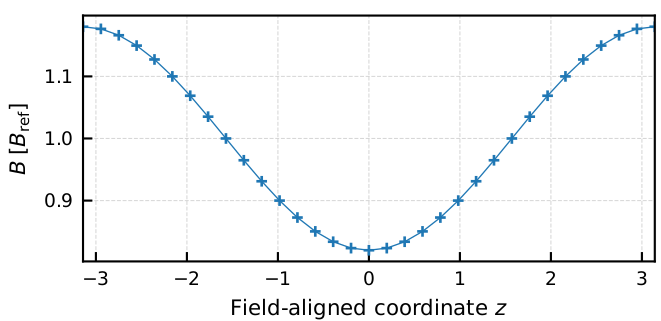

   Distribution of magnetic field strength along the field-line coordinate z

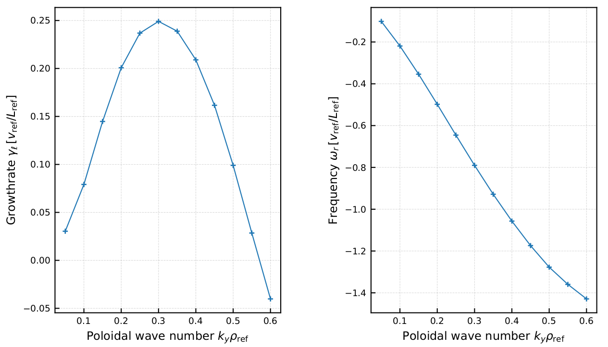

   Dependence of linear growth rate and real frequency on poloidal wavenumber

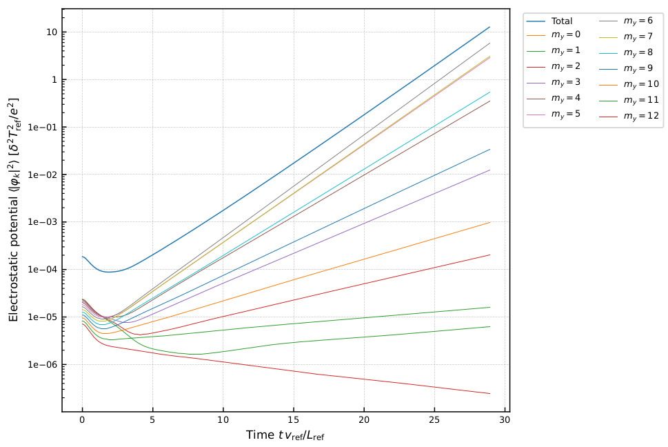

   Time evolution of squared fluctuation amplitude for each poloidal mode number

c) ``diag_python``: a collection of post-processing Python scripts for analyzing binary data

``diag_python`` is downloaded and unpacked in the GKV output directory ``/data/(user ID)/gkv_training/linear_test/``.

.. code-block:: console

   $ cd /data/(User ID)/gkv_training/linear_test/
   $ wget https://github.com/GKV-developers/diag_python/archive/refs/tags/f0.65_01.tar.gz -O
   $ diag_python-f0.65_01.tar.gz
   $ tar xzvf diag_python-f0.65_01.tar.gz

Although the tools may be invoked from any familiar Python environment on the user side, this section illustrates the use of JupyterLab provided by the web front-end service **Open OnDemand** on the Plasma Simulator. [See “Plasma Simulator User Guide”, Section 10.1.10.]

.. note::

   *Note:* By using SSH port forwarding, it is also possible to start a Jupyter server on the Plasma Simulator and access it from the user’s local PC. This is a general approach that can be used even on other supercomputer systems where a web front-end service such as Open OnDemand is not available.

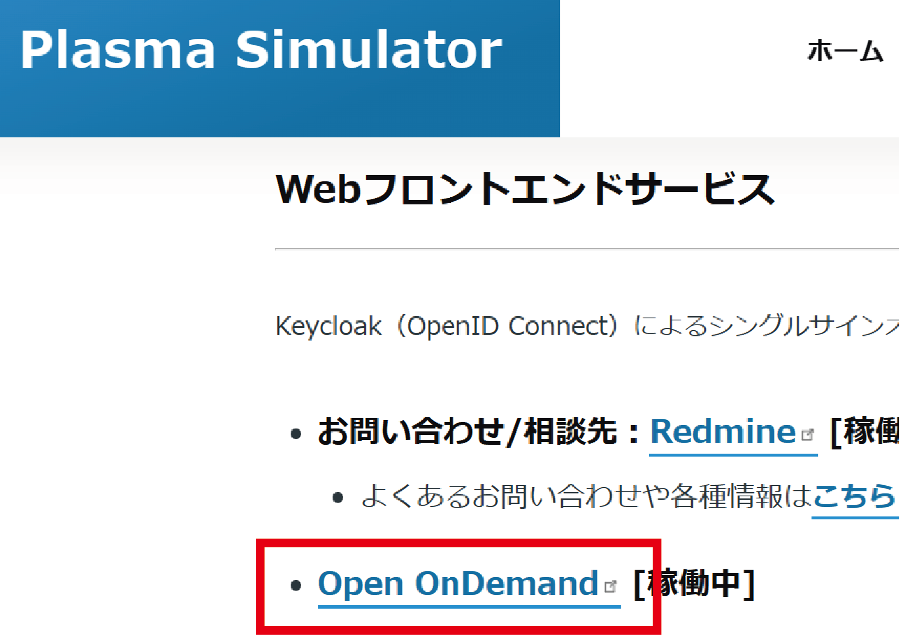

   Selection of Open OnDemand on the Plasma Simulator

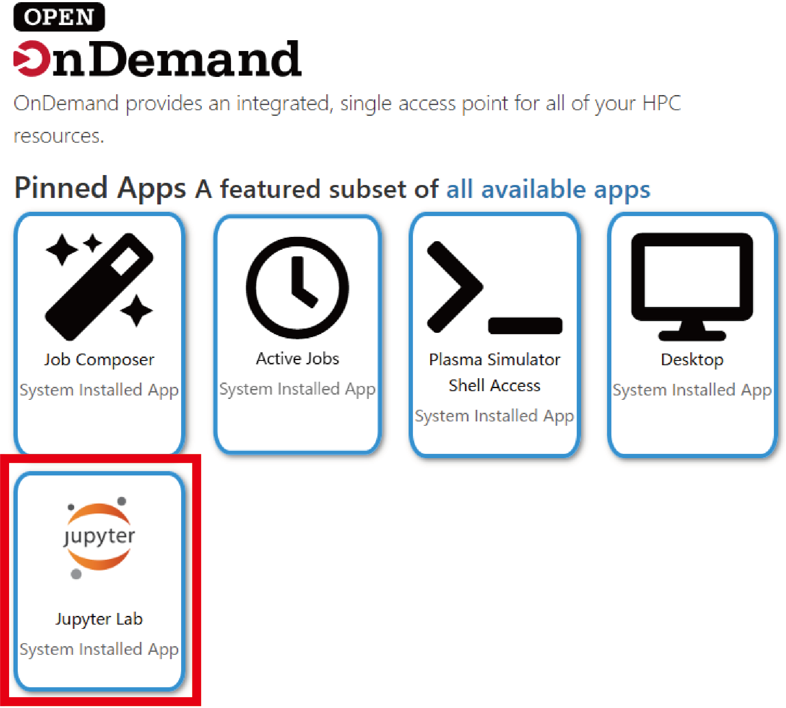

   Selection of JupyterLab on Open OnDemand

An initial configuration is performed so that the user-created Python virtual environment ``env01`` can be added to the Jupyter kernels launched by Open OnDemand. From Jupyter, a Terminal is started and ``~/myvenv/env01/pyvenv.cfg`` is edited (this setting allows access to the ``ipykernel`` environment used by Jupyter launched via Open OnDemand).

The value of ``include-system-site-packages`` is changed from ``false`` to ``true``.

.. code-block:: text
   :caption: ~/myenv/env01/pyvenv.cfg

   home = /usr/bin
   include-system-site-packages = true
   version = 3.12.9
   executable = /usr/bin/python3.12
   command = /usr/bin/python3.12 -m venv /home/(User ID)/myvenv/env01

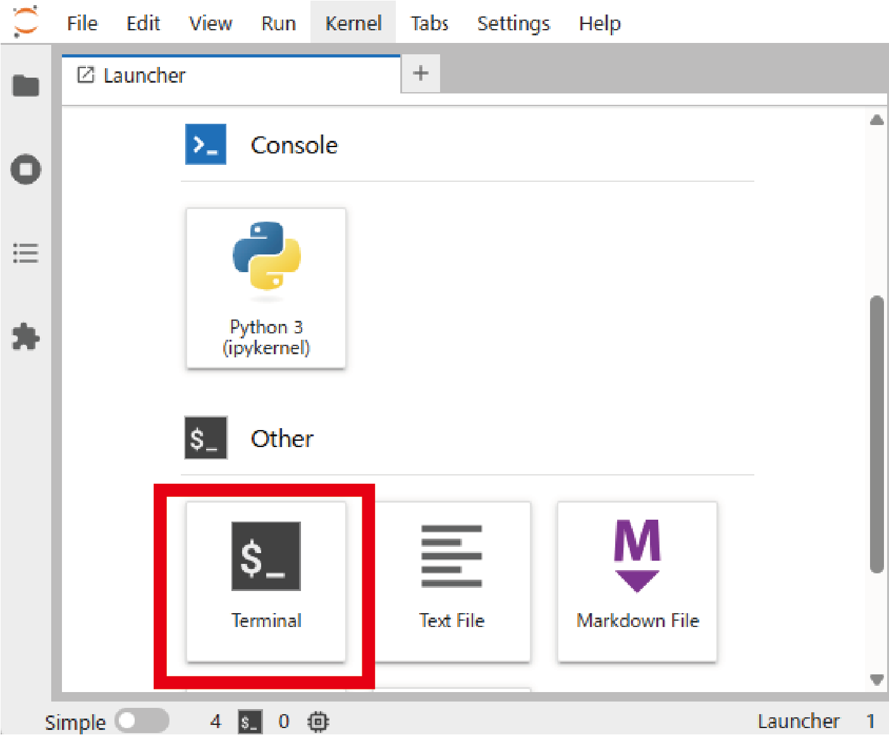

   Launching a Terminal in Jupyter.

Next, the Jupyter kernel for ``env01`` is registered by executing the following command in the Terminal.

.. code-block:: console

   $ source ~/myvenv/env01/bin/activate # Optional if env01 is already activated
   $ python -m ipykernel install --user --name=env01

.. note::

   *Note:* The environment that is added here is the Python environment active at the time this command is executed (which should be the one previously activated with :code:`$ source ~/myvenv/env01/bin/activate`). The suffix ``--name=env01`` specifies the kernel name registered in Jupyter and can be changed arbitrarily, but it is generally safest to keep it consistent with the name of the virtual environment. If the registration is successful, the ``env01`` kernel appears in the JupyterLab Launcher.

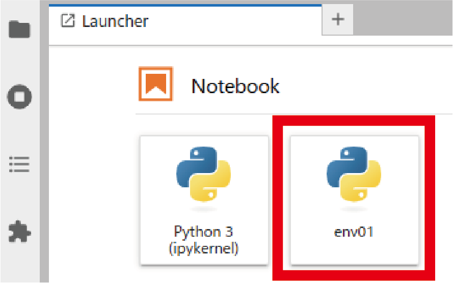

   Display of the env01 kernel in the JupyterLab Launcher

In addition, a symbolic link is created so that the ``/data/(user ID)/`` directory can be accessed.

.. code-block:: console

   $ ln -s /data/(User ID)/ ~/data

Supplementary note 1. Handling Jupyter kernels

- Registration of a Jupyter kernel from a Python environment
  (for example, registering it with the kernel name ``env01``)

.. code-block:: console

   $ python -m ipykernel install --user --name=env01

- Checking the list of available Jupyter kernels

.. code-block:: console

   $ jupyter kernelspec list

- Removal of a Jupyter kernel
  (for example, deleting the ``env01`` kernel)

.. code-block:: console

   $ jupyter kernelspec remove env01

.. note::

   *Note:* Jupyter itself is an integrated development environment that supports not only Python but also many other languages such as R and Julia. When registering a kernel, one can think of it as submitting an additional “registration request” from the user’s Python environment to the Jupyter installation on the system side, using ``ipykernel``. On the other hand, management of kernels that have already been registered is performed with the ``jupyter kernelspec`` command.

----

Supplementary note 2. Handling symbolic links

- Example of creating a symbolic link:

.. code-block:: console

   $ ln -s /data/(User ID)/ ~/data

- Example of deleting a symbolic link:

.. code-block:: console

   $ unlink ~/data

.. note::

   *Note:* Symbolic links are removed with ``unlink``.
   Although ``rm`` can also be used, there is a risk of accidentally deleting the directory itself,
   so the use of ``unlink`` is strongly recommended.

**Example that must be strictly avoided (should never do):**
If :code:`$ rm ~/data/` is mistakenly executed, the ``rm`` command is applied not to the symbolic link ``~/data`` itself, but to its target ``~/data/ = /data/(user ID)/``.

The basic operations for using diag_python are outlined below.

- The notebook ``main.ipynb`` is opened.

- A cell is selected, and its contents are executed with ``[Shift] + [Enter]``.

- All intermediate variables and similar information remain in memory. To start again from the beginning, the menu items **[Kernel] – [Restart Kernel and Clear All Outputs]** are chosen from the top menu.

By clicking on the ``env01`` area shown below :numref:`fig:plasma_simulator_ondemand_5`, the Jupyter kernel selection screen shown in :numref:`fig:plasma_simulator_ondemand_6` can be displayed.

.. note::

   *Note:*
   The first cell loads the paths of the Zarr files and of the header, namelist, and metric data,
   and performs the initial setup of various geometry data. Execution of this cell is essential.

.. note::

   *Note:*
   Cells from the second one onward are executed as needed according to the desired analysis.

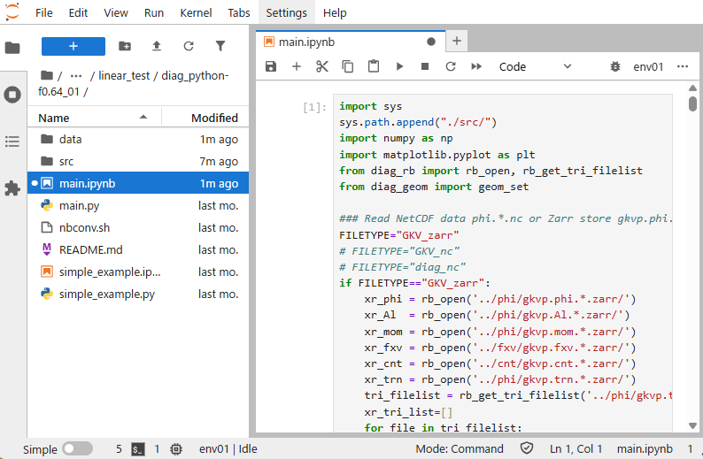

   Display of main.ipynb

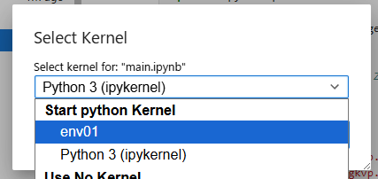

   Switching of Jupyter kernels

An example of a Python script for using ``diag_python`` (``simple_example.ipynb``) is shown.
In ``simple_example.ipynb``, the following operations are performed:

- The path is extended so that the Python scripts in ``diag_python/src/`` can be imported.
- The Zarr-format data ``gkvp.phi.*.zarr/`` are loaded (using xarray).
- Information such as the namelist is loaded and magnetic-configuration data are constructed; these are used for calculations such as flux-surface averages.
- Functions are imported from modules corresponding to the desired analysis and then executed.

In this example, the function ``phiinxy`` defined in ``./src/out_mominxy.py`` is imported. It computes the two-dimensional perpendicular distribution :math:`\phi(y,x)` of the electrostatic potential at a given time :math:`t[\text{it}]` and at a given position :math:`zz[\text{iz}]` along the magnetic field line.

The options ``flag="display"`` and ``flag="savefig"`` control whether a figure is displayed or saved. If ``flag=None``, the data ``x``, ``y``, and :math:`\phi(y,x)` are returned, so users can plot them in any preferred way.

*For further details, see the help text by calling* ``help(phiinxy)``.

.. code-block:: python
   :caption: simple_example.ipynb

   ### Append diag_python packages to path ###
   import sys
   sys.path.append("./src/")

   ### Read Zarr format data *.zarr/ by xarray ###
   from diag_rb import rb_open
   xr_phi = rb_open('../phi/gkvp.phi.*.zarr')

   ### Set geometric constants from GKV namelist etc. ###
   from diag_geom import geom_set
   geom_set(headpath='../src/gkvp_header.f90',
            nmlpath='../gkvp_namelist.001',
            mtrpath='../hst/gkvp.mtr.001')

   # Plot phi[y,x] at t[it], zz[iz]
   from out_mominxy import phiinxy
   it = 250
   iz = 48
   phiinxy(it, iz, xr_phi, flag="display")

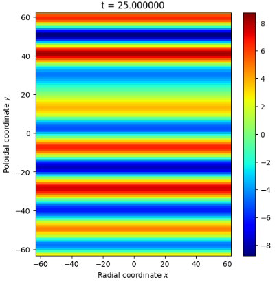

   Two-dimensional perpendicular distribution of the electrostatic potential

.. _sec_nonlinear-turbulence-simulation:

Nonlinear turbulence simulation
----------------------------------------

This section describes the execution and data analysis of nonlinear turbulence simulations as an application.

The physical parameters used in the linear calculation are modified for use in nonlinear turbulence simulations.

.. code-block:: fortran
   :caption: run/gkvp_namelist

   &calct calc_type="nonlinear",   ! Change calculation type to nonlinear
   ...
   &runlm e_limit = 3600.d0, &end  ! Increase wall-clock time limit [s] for the run
   ...
   &nperi n_tht = 1,           ! Change box size along field line to ±pi in poloidal angle
          kymin = 0.05d0,      ! Box size in field-line label direction ly = pi / kymin
          m_j   = 4,           ! Radial box size lx = pi / kxmin
          del_c = 0.d0, &end   ! kxmin = |2 * pi * s_hat * kymin / m_j|
   ...                         ! Adjust so that lx and ly become reasonably close to each other

The resolution and the number of MPI processes are also adjusted so that multiple modes are treated.

.. code-block:: fortran
   :caption: src/gkvp_header.f90

   integer, parameter :: nxw = 84, nyw = 42
   integer, parameter :: nx = 55, global_ny =27 ! 2/3 de-aliasing rule
   integer, parameter :: global_nz = 24, global_nv = 32, global_nm = 15
   ...
   integer, parameter :: nprocw = 2, nprocz = 3, nprocv = 4, nprocm = 2, nprocs = 1

The script ``sub.q`` is modified in accordance with the simulation runtime and the number of MPI processes.

.. code-block:: csh
   :caption: run/sub.q

   …
   #PBS -P NIFS23KIST041      # Project name
   #PBS -q A_S                # Queue class A_dev / A_S / A_M / A_L
   #PBS -l walltime=01:30:00  # Wall-clock time limit (hh:mm:ss)
   #PBS -l select=4:ncpus=128:mem=384gb:mpiprocs=12
                              # Resource request. See Section 8.1.2 of the Plasma Simulator User Guide.
   export OMP_NUM_THREADS=10  # Number of OpenMP threads per MPI process
   …

The output destination directory is also changed.

.. code-block:: csh
   :caption: run/shoot

   DIR=/data/(user ID)/gkv_training/nonlinear_test/  # Data output directory after execution

Compilation is carried out with ``make``, and the job is submitted with ``./shoot 1 1``.

.. note::

   *Note:* The resolution settings in this example are based on the ITGae-nl case in ``benchmarks/``.
   It is useful to check whether the results obtained from one’s own simulation agree with the reference data contained in ``benchmarks/``.

In nonlinear simulations, however, the time series may not coincide step by step with the benchmark because of the accumulation of numerical errors and similar effects.

As an example of nonlinear simulation output, excerpts from ``fig_stdout.pdf`` are shown.
In the time evolution of the fluctuation amplitude for each poloidal mode number (:numref:`fig:nonlinear_fig_stdout_electrostatic_potential`), it can be seen that the zonal flow with ky=0 (my=0) is dominant. In the time evolution of the ion heat transport flux Q_E for each poloidal mode number (:numref:`fig:nonlinear_fig_stdout_energy_flux`), the mode with ky=0.2 (my=4) is mainly responsible for the transport. The evaluation of the entropy balance (:numref:`fig:nonlinear_fig_stdout_entropy_variables`) shows that drive :math:`(\Theta / L_T)` and dissipation :math:`(D)` are balanced and the system reaches a steady state :math:`(dS/dt \sim 0)`, and the error is kept at a low level.

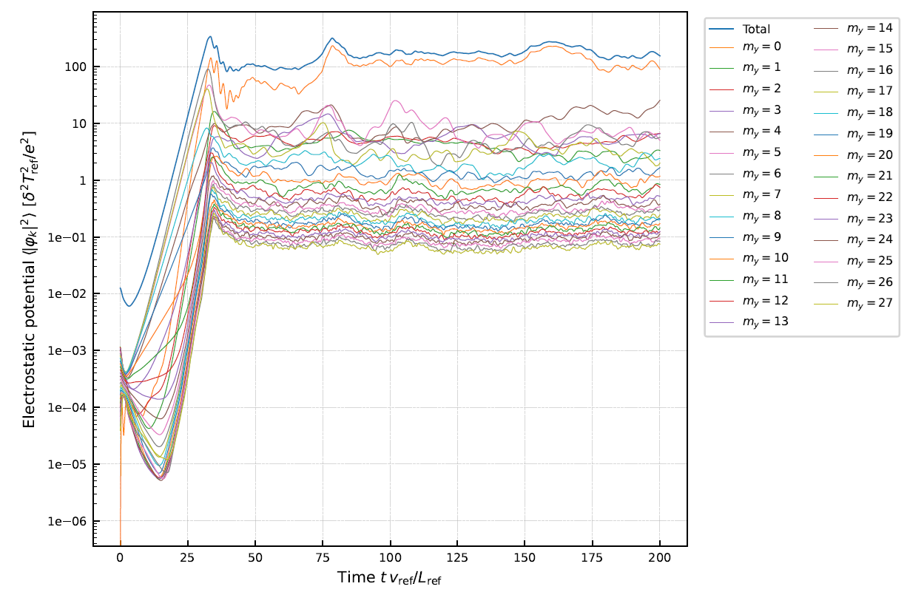

   Time evolution of the squared fluctuation amplitude for each poloidal mode number

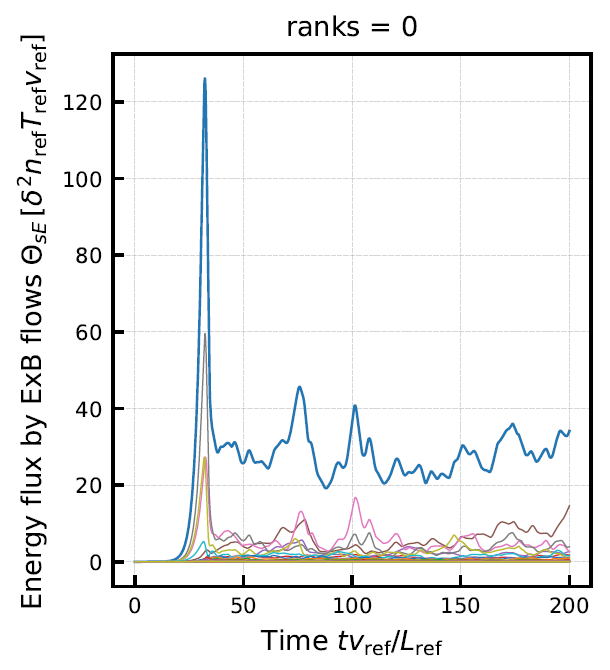

   Time evolution of ion heat transport flux for each poloidal mode number

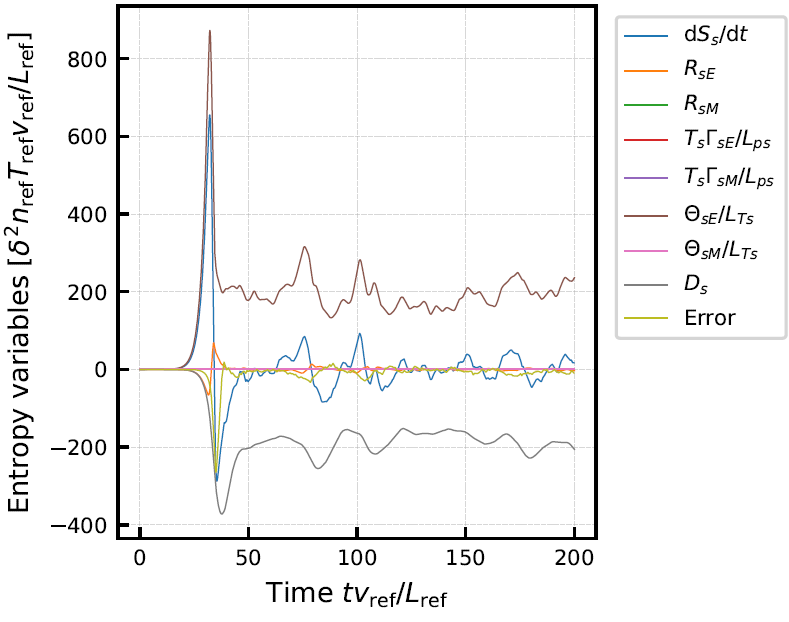

   Evaluation of entropy balance
